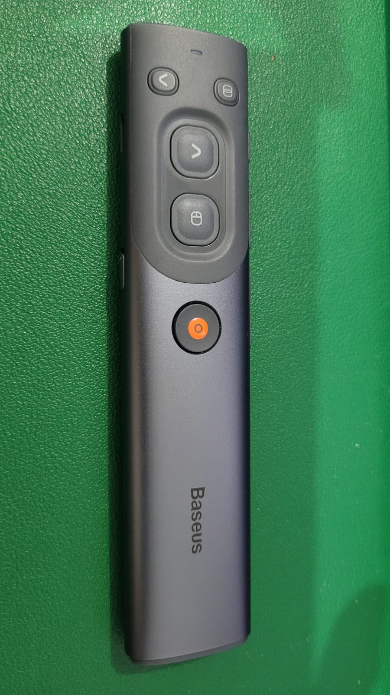
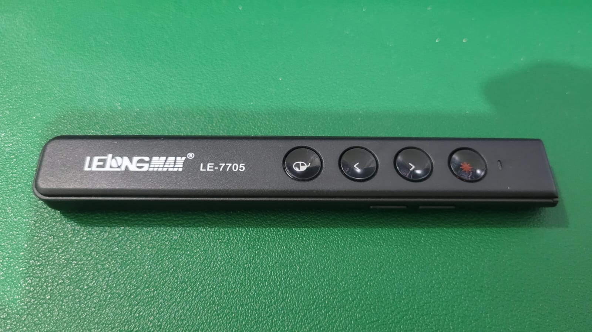
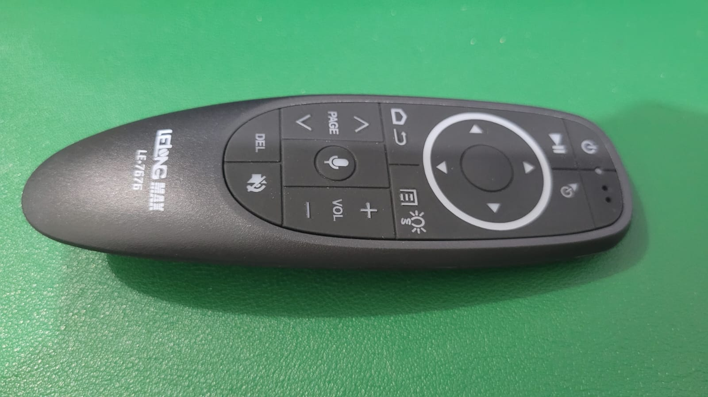

# SpotPress

**SpotPress** is a modern, presentation tool written in Python.
It provides a spotlight/laser pointer overlay for live presentations, supporting multiple display setups and advanced features like pen drawing, magnifier, and full device integration.

**Notice: currently only works on Linux with X11 interface backend**

---

## ✨ Features

- 🌟 **Spotlight** and **Laser Pointer** modes
- 🖍️ **Pen drawing** overlay on slides or screen
- 🔍 **Magnifying Glass** mode
- 🖥️ Multi-monitor support
- ⚙️ Graphical preferences window (via system tray)
- 🎮 Integration with presenter remote controls (e.g. Baseus, etc )
- 🧹 Modular device detection (Linux & Windows)
- 🛠️ Command-line control with `spotpressctl`
- 📆 Works with PyQt5 or PyQt6

---

## Currently Supported Pointers:

- Baseus Orange Dot Wireless Presenter - ID `abc8:ca08` - _iTing BaseusPresent_
- LeLong LE-7705 - ID `1915:1001` - _Nordic Semiconductor ASA Smart Control_
- LeLong LE-7676 - ID `1915:1025` - _Nordic Semiconductor ASA USB Composite Device_

## 💻 Dependencies

### On Debian/Ubuntu-based systems:

#### If PyQt6 is available:

```bash
sudo apt install pyqt6-dev pyqt6-dev-tools python3-pyudev python3-evdev python3-uinput
```

#### Or if using PyQt5:

```bash
sudo apt install pyqt5-dev pyqt5-dev-tools python3-pyudev python3-evdev python3-uinput
```

You may also need `libuinput-dev` for some systems.

---

## 🚀 Running SpotPress

To start the main application:

```bash
python3 main.py
```

It will run in the background with a system tray icon. From there, you can open the preferences window, configure devices, and manage overlay modes.

---

## 🧠 Command-Line Tool

The `spotpressctl` utility allows controlling the running instance from the command line:

### Usage:

```bash
spotpressctl [command]
```

### Available commands:

| Command               | Description                                                           |
| --------------------- | --------------------------------------------------------------------- |
| `--start`             | Starts SpotPress if not already running                               |
| `--show-window`       | Opens the configuration window                                        |
| `--hide-window`       | Hides the configuration window                                        |
| `--quit`              | Terminates the SpotPress process                                      |
| `--set-mode=<MODE>`   | Sets mode: `mouse`, `spotlight`, `laser`, `pen`, `mag_glass` or `0-4` |
| `--set-auto-mode=on`  | Enables automatic device-based switching                              |
| `--set-auto-mode=off` | Disables automatic mode switching                                     |

Example:

```bash
spotpressctl --set-mode=spotlight
```

---

## 🛠 Development

### Install dependencies via `pip` (optional):

```bash
pip install -r requirements.txt
```

Or for development:

```bash
pip install -e .
```

### Run from source:

```bash
python3 main.py
```

### To create a command line on system

```
sudo ln -s /path/to/spotpressctl.py /usr/local/bin/spotpressctl
```

---

## 📁 Project Structure

- `main.py` – Entry point to launch the application
- `spotpressctl.py` – Command-line controller
- `spotpress/` – Core source code
- `spotpress/ui/` – UI components and tabs
- `spotpress/hw/` – Device detection backends
- `spotpress/qtcompat.py` – Qt compatibility wrapper
- `README.md` – This file

---

## Configuration

Settings are stored in `~/.config/spotpress/config.ini` and managed via the GUI.

---

## 📝 License

This project is licensed under the **LGPL License**.

---

## 👨‍💻 Author

# SpotPress

SpotPress is an advanced spotlight presentation tool written in Python, offering powerful visual cues for presenters, including spotlighting, laser pointer simulation, pen drawing, and magnifying glass overlays.

**Notice: currently only works on Linux with X11 interface backend**

## Features

- Cross-platform GUI using PyQt5 or PyQt6
- Fullscreen spotlight and laser overlays
- Customizable overlay modes (spotlight, laser, pen, magnifying glass)
- System tray integration
- Configurable via GUI or CLI (`spotpressctl`)
- Pointer device detection and automatic mode switching
- Multi-monitor support
- Persistent user configuration
- IPC for external control and scripting

## Installation

### Debian-based Linux systems:

For PyQt6 (if available in your distribution's repositories):

```bash
sudo apt install pyqt6-dev pyqt6-dev-tools python3-pyudev python3-evdev python3-uinput
```

For PyQt5:

```bash
sudo apt install pyqt5-dev pyqt5-dev-tools python3-pyudev python3-evdev python3-uinput
```

## Usage

To start the application:

```bash
python3 main.py
```

To send commands externally:

```bash
spotpressctl --show-window
spotpressctl --set-mode=spotlight
spotpressctl --quit
```

To start SpotPress from CLI if not already running:

```bash
spotpressctl --start
```

### Supported CLI Commands (via `spotpressctl`):

- `--show-window`: Show SpotPress main window
- `--hide-window`: Hide SpotPress window
- `--quit`: Quit the running instance
- `--start`: Launch SpotPress if not running
- `--set-mode=MODE`: Change to one of the overlay modes:
  - `mouse`, `0`
  - `spotlight`, `1`
  - `laser`, `2`
  - `pen`, `3`
  - `mag_glass`, `4`

- `--set-auto-mode=on|off`: Enable or disable automatic mode switching based on the active pointer device

## Configuration

Settings are stored in `~/.config/spotpress/config.ini` and managed via the GUI.

## Currently Supported Pointers:

### Baseus Orange Dot Wireless Presenter

- ID `abc8:ca08` - _iTing BaseusPresent_
  

### LeLong LE-7705

- ID `1915:1001` - _Nordic Semiconductor ASA Smart Control_
  

### LeLong LE-7676

- ID `1915:1025` - _Nordic Semiconductor ASA USB Composite Device_
  

## Permission Problems

You may run into permissio problems when try to run spotpress.

`packages/uinput/__init__.py", line 74, in _open_error_handler
    raise OSError(code, msg)
PermissionError: [Errno 13] Failed to open the uinput device:`

you need to make shure you have uinput kernel module loaded:

### How to solve:

Verify if the uinput module was loaded:

`lsmod | grep uinput`

### If nothins is shown, load manually the module:

`sudo modprobe uinput`

### Vefify the permissions:

`ls -l /dev/uinput`

Typical output:

`crw------- 1 root root 10, 223 set 22 15:30 /dev/uinput`

### Run command:

sudo chmod 666 /dev/uinput

the application should run. To make the changes permanent after reboot create the file:
`/etc/udev/rules.d/99-uinput.rules`

with content:

`KERNEL=="uinput", MODE="0660", GROUP="input", OPTIONS+="static_node=uinput"`

### And as per device configuration you may need to create some udev rules files as follows:

### Baseus Orange dot AI

`/etc/udev/rules.d/99-baseus.rules`

`
SUBSYSTEM=="hidraw*", ATTRS{idVendor}=="abc8", ATTRS{idProduct}=="ca08", MODE="0666"
KERNEL=="hidraw*", ATTRS{idVendor}=="abc8", ATTRS{idProduct}=="ca08", MODE="0666"
SUBSYSTEM=="input*", ATTRS{idVendor}=="abc8", ATTRS{idProduct}=="ca08", MODE="0666"
KERNEL=="input*", ATTRS{idVendor}=="abc8", ATTRS{idProduct}=="ca08", MODE="0666"`

### Lelong Pointer

`/etc/udev/rules.d/99-lelong.rules`

`
SUBSYSTEM=="hidraw*", ATTRS{idVendor}=="1915", ATTRS{idProduct}=="1001", MODE="0666"
KERNEL=="hidraw*", ATTRS{idVendor}=="1915", ATTRS{idProduct}=="1001", MODE="0666"
SUBSYSTEM=="hidraw*", ATTRS{idVendor}=="1915", ATTRS{idProduct}=="1025", MODE="0666"
KERNEL=="hidraw*", ATTRS{idVendor}=="1915", ATTRS{idProduct}=="1025", MODE="0666"`

### After add your user to input group

`sudo usermod -aG input $USER`

then reload the rules:

`sudo udevadm control --reload-rules && sudo udevadm trigger`

## Developing

To run in development mode:

```bash
python3 main.py --debug
```

SpotPress uses:

- PyQt5/PyQt6
- evdev / pyudev for device detection on Linux
- QLocalSocket / QLocalServer for IPC

## License

SpotPress is licensed under the LGPL.

## Contributors

- Alexandre da Silva ()

---

Feel free to contribute or report issues via the repository!
**Alexandre da Silva**
Contact: <lexrupy>

Contributions are welcome via pull requests or issue reports.
