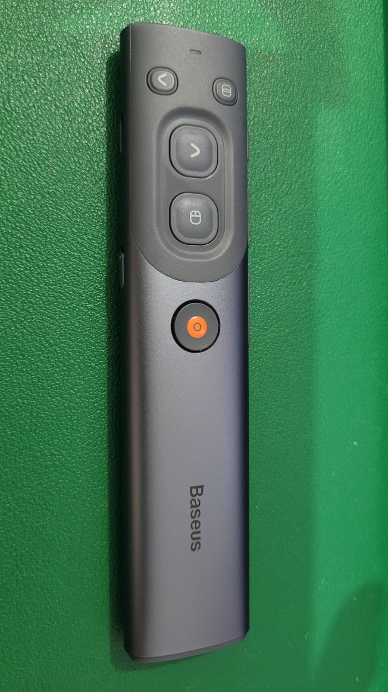
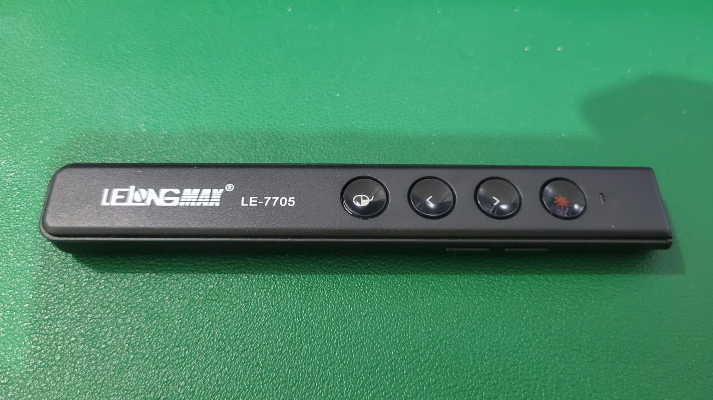

# SpotPress

SpotPress is an advanced spotlight presentation tool written in Python, offering powerful visual cues for presenters, including spotlighting, laser pointer simulation, pen drawing, and magnifying glass overlays.

**Notice: currently only works on Linux with X11 interface backend**

## Features

- Cross-platform GUI using PyQt5 or PyQt6
- Fullscreen spotlight and laser overlays
- Customizable overlay modes (spotlight, laser, pen, magnifying glass)
- System tray integration
- Configurable via GUI or CLI (`spotpressctl`)
- Pointer device detection and automatic mode switching
- Multi-monitor support
- Persistent user configuration
- IPC for external control and scripting

## Installation

### Debian-based Linux systems:

For PyQt6 (if available in your distribution's repositories):

```bash
sudo apt install pyqt6-dev pyqt6-dev-tools python3-pyudev python3-evdev python3-uinput
```

For PyQt5:

```bash
sudo apt install pyqt5-dev pyqt5-dev-tools python3-pyudev python3-evdev python3-uinput
```

## Usage

To start the application:

```bash
python3 main.py
```

To send commands externally:

```bash
spotpressctl --show-window
spotpressctl --set-mode=spotlight
spotpressctl --quit
```

To start SpotPress from CLI if not already running:

```bash
spotpressctl --start
```

### Supported CLI Commands (via `spotpressctl`):

- `--show-window`: Show SpotPress main window
- `--hide-window`: Hide SpotPress window
- `--quit`: Quit the running instance
- `--start`: Launch SpotPress if not running
- `--set-mode=MODE`: Change to one of the overlay modes:

  - `mouse`, `0`
  - `spotlight`, `1`
  - `laser`, `2`
  - `pen`, `3`
  - `mag_glass`, `4`

- `--set-auto-mode=on|off`: Enable or disable automatic mode switching based on the active pointer device

## Configuration

Settings are stored in `~/.config/spotpress/config.ini` and managed via the GUI.

## Currently Supported Pointers:

### Baseus Orange Dot Wireless Presenter

- ID `abc8:ca08` - _iTing BaseusPresent_
  

### LeLong LE-7705

- ID `1915:1001` - _Nordic Semiconductor ASA Smart Control_
  

### LeLong LE-7676

- ID `1915:1025` - _Nordic Semiconductor ASA USB Composite Device_
  

## Developing

To run in development mode:

```bash
python3 main.py --debug
```

SpotPress uses:

- PyQt5/PyQt6
- evdev / pyudev for device detection on Linux
- QLocalSocket / QLocalServer for IPC

## License

SpotPress is licensed under the LGPL.

## Contributors

- Alexandre da Silva ()

---

Feel free to contribute or report issues via the repository!
